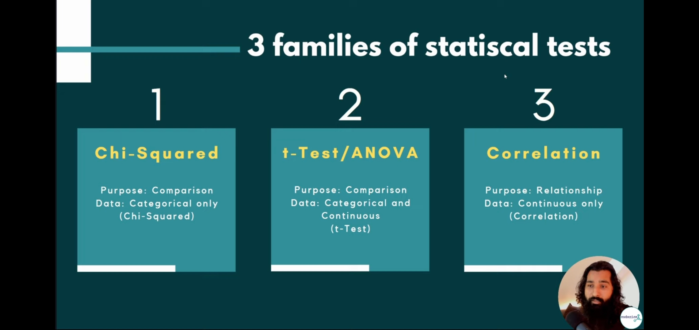
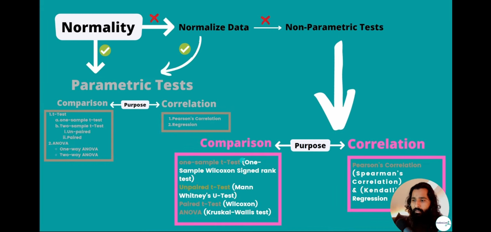

# Test and their types
Parametric test and Non-parametric test \

# Step-1 Normality test

# Step-2 Homogenity Test
- we will do levene test 

# Step-3 Purpose 
- purpose of our research question
- 

# Step-3 Purpose 
- purpose of our research question
- Two types of purposes
- 

## comparision and relationship
- samosa example

- if comparision must be atleast 2 groups

- if relationship must be connection between them
  - it is corelation or relationship

# Step-4 Data Type
Either it is catagorical or continuous

- catagorical 

- continuous
- 

 - example
 - 

# Step-5 Stastitical Test
- under 3 families (basics)

## chi-square test

## t-Test/ANOVA test
**one-sample t-Test**
- compare from a known value (up and down data), like height of all samples from a known value (5.
5 feet)

**paired t-Test**
- just females height difference 

**un-paired t-Test**
- both female and male height difference 

**ANOVA**
- more than 2 groups

# Corelation
- relationship between continuous variables in a dataset 

# Importane things
Your data must be normal or follow a gaussian distribution.\
If data is not normal, we will normalize it with different method.\
If not reliable results, then we disturbed all test. 

If data is not normal and assumption are not same then we have to do first normality , then secondly check homogenity.

If still not normal and non-parametric test then 

# Types of ANOVA

# Some other tests

# flow diagram of this whole lecture
