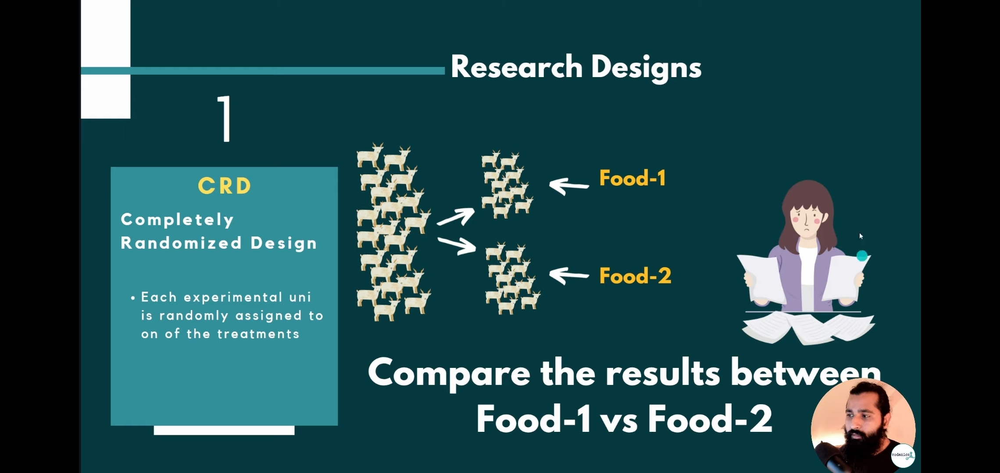
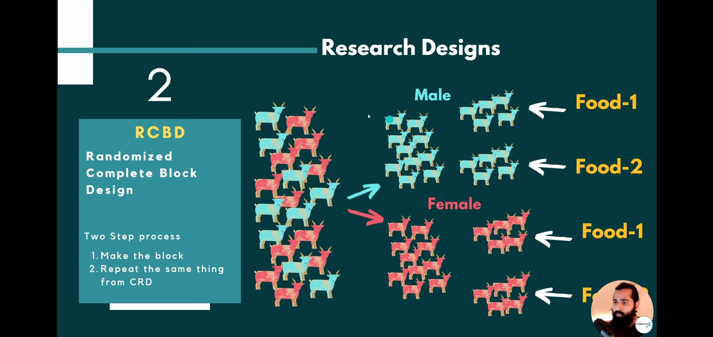
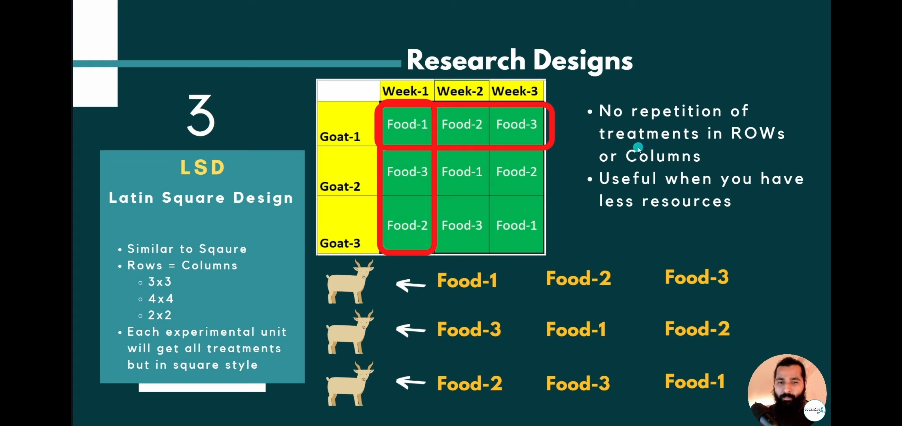

# CRD RCBD LSD
## CRD
**Completely randomized design**

- radomly divided or choosed and for our research design . and we will compare food 1 and food 2.

## RCBD
**Randomized complete block deisgn**

  - 2 STEP PROCESS , make a block and then apply CRD
  - i.e male and female seperated for test
  - 2 factors, gender and food, 

## LSD
**Latin Square Design**
 - rows = columns
 - similar to square
 - each experimental unit will get all trearments in square style
